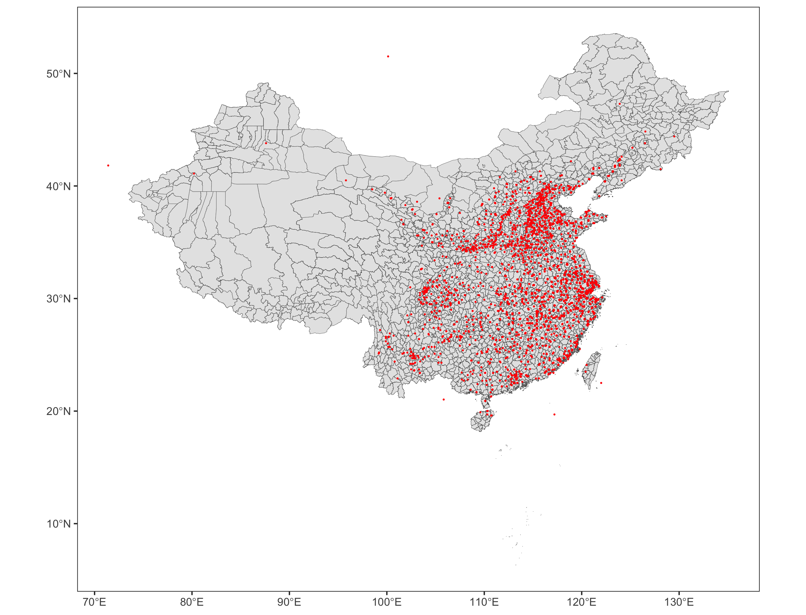
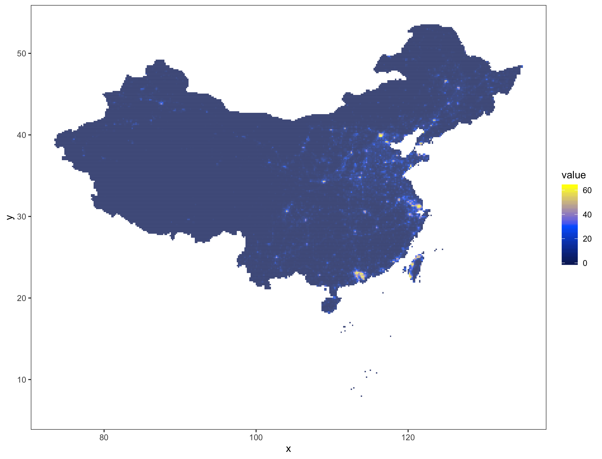
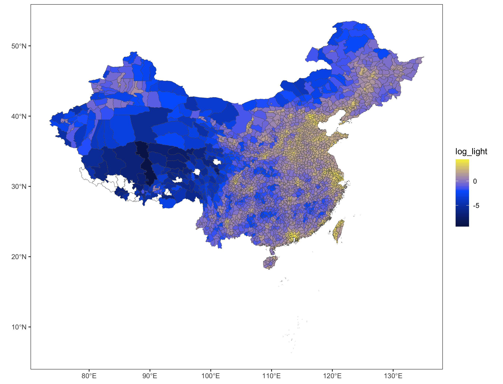

PS239: Path Dependance of Economic Development
========================================================
author: Zenan Wang  
date: 11/30/2016
autosize: true

Data
========================================================

- Grand Secretariat Archive Project
- NOAA Nighttime Lights Time Series (2005)
- China County Shapefile

Scraping Website with Python
========================================================
[Biography page](http://archive.ihp.sinica.edu.tw/ttscgi/ttsquery?0:0:mctauac:NO%3DNO2)

Cleaning Biography Data in R
========================================================
- Extract GPS information and perform GIS spatial manipulation

Cleaning Biography Data in R
========================================================
- Spatial Aggregation to County Level

Visualize Night Light Data in R
========================================================
- Night Light in 2005 

Visualize Night Light Data in R
========================================================
- Aggregate night light data to county level

Regression
========================================================
- Regression

